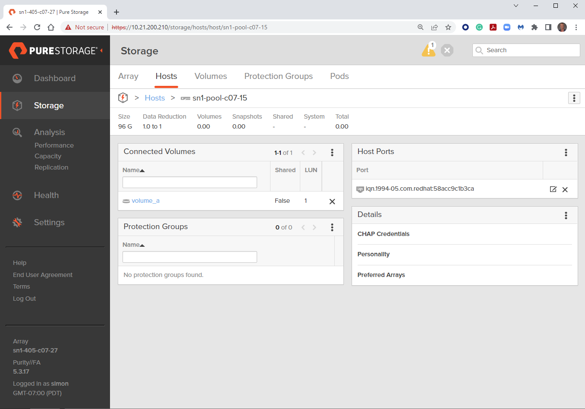

# Exercise 1.3 - Connecting volumes to a host on a FlashArray

# Objective

Demonstrate the use of the [purefa_host module](https://docs.ansible.com/ansible/latest/collections/purestorage/flasharray/purefa_host_module.html) to connect an existing volume to a host on a Pure Storage FlashArray.

# Guide

## Step 1:

Using the text editor, create a new file called `purefa-connect.yml`.

## Step 2:

Enter the following play definition into `purefa-connect.yml`:

```yaml
---
- name: CONNECT SETUP
  hosts: localhost
  connection: local
  gather_facts: true
  vars:
    url: flasharray1.testdrive.local
    api: e448c603-ecfd-8b4e-fc02-0d742e81a779
    vol: volume_a
```

- The `---` at the top of the file indicates that this is a YAML file.
- The `hosts: localhost`, indicates the play is run on the current host.
- `connection: local` tells the Playbook to run locally (rather than SSHing to itself)
- `gather_facts: true` enables facts gathering.
- The `vars:` parameter is a group of parameters to be used in the playbook.
- `url: flasharray1.testdrive.local` is the management IP address of your FlashArray - change this reflect your local environment.
- `api: e448c603-ecfd-8b4e-fc02-0d742e81a779` is the API token for a user on the FlashArra - change this reflect your local environment.

## Step 3:

Next, add the first `task` to the playbook. This task will use the `purefa_host` module to attach one of the volumes created in [Exercise 1.2](../1.2-add-volumes) to the host created in [Exercise 1.1](../1.1-add-host) on the Pure Storage FlashArray.

```yaml
tasks:
  - name: ATTACH VOLUMES
    purestorage.flasharray.purefa_host:
      name: "{{ ansible_hostname }}"
      volume: "{{ vol }}"
      fa_url: "{{ url }}"
      api_token: "{{ api }}"
```

- `name: ATTACH VOLUMES` is a user defined description that will display in the terminal output.
- `purefa_host:` tells the task which module to use.
- The `name` parameter tells the module to use the `ansible_hostname` variable obtained from the host fact gathering.
- The `volume` parameter tells the module ito use the `vol` variable as the name of the volume to connect to the host object.
- The `fa_url: "{{url}}"` parameter tells the module to connect to the FlashArray Management IP address, which is stored as a variable `url` defined in the `vars` section of the playbook.
- The `api_token: "{{api}}"` parameter tells the module to connect to the FlashArray using this API token, which is stored as a variable `api` defined in the `vars` section of the playbook.

Save the file and exit out of the editor.

## Step 4:

Run the playbook - Execute the following:

```
$ ansible-playbook purefa-connect.yml
```

# Playbook Output

```yaml
$ ansible-playbook purefa-volume.yml

PLAY [CONNECT SETUP] ****************************************************************************************************

TASK [Gathering Facts] **************************************************************************************************
ok: [localhost]

TASK [CONNECT VOLUMES] **************************************************************************************************
changed: [localhost]

PLAY RECAP **************************************************************************************************************
localhost                  : ok=2    changed=1    unreachable=0    failed=0    skipped=0    rescued=0    ignored=0
```

# Verifying the Solution

Login to the Pure Storage FlashArray with your web browser.

Navigating using the menu on the left to Storage, then select Hosts top menu, finally select the host object you have created in the Hosts sub-window. This will show the volume connected to the host and the LUN ID assigned to the volume.

# Going Further

For a bonus exercise you can rescan the iSCSI dataplane on your host to discover the newly connected volume, format and mount the volume, making it ready for application or user use.

Add the following tasks to the playbook:

```yaml
    - name: GET VOLUME SERIAL NUMBER
      purestorage.flasharray.purefa_info:
        gather_subset: volumes
        fa_url: "{{ url }}"
        api_token: "{{ api }}"
      register: volumes_data

    - set_fact:
        volume_serial: "{{ volumes_data.purefa_info.volumes[vol].serial }}"

    - name: RESCAN MULTIPATH
      ansible.builtin.command: /usr/sbin/multipath -r
      ansible.builtin.command: /usr/bin/scsi-rescan

    - name: GET DEVICE ID FOR VOLUME
      ansible.builtin.shell:
        cmd: /usr/sbin/multipath -ll |grep -i {{ volume_serial }}| awk '{print $2}'
      register: mpath_dev

    - name: FORMAT VOLUME
      community.general.filesystem:
        fstype: ext4
        dev: '/dev/{{ mpath_dev.stdout }}'

    - name: MOUNT VOLUME
      ansible.posix.mount:
        path: "/workshop-mount"
        fstype: ext4
        src: '/dev/{{ mpath_dev.stdout }}'
        state: mounted
```

Note that if using RHEL or CentOS the `scsi-rescan` command will need to be replaced with `rescan-scsi-bus.sh` that is provided in the `sg3_utils` package.

Run the playbook - Execute the following:

```
$ ansible-playbook purefa-connect.yml
```

and then execute the command `mount /workshop-mount`.
