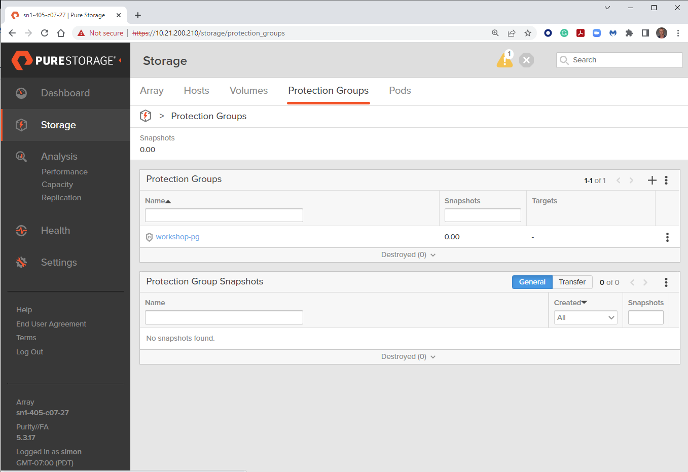
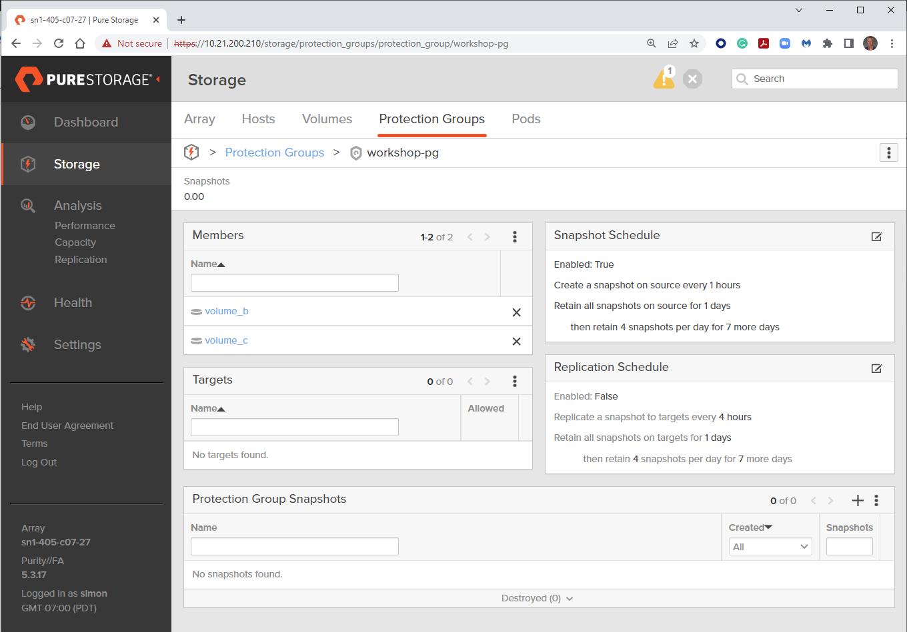

# Exercise 1.4 - Creating a Protection Group on a FlashArray

# Objective

Demonstrate the use of the [purefa_pg module](https://docs.ansible.com/ansible/latest/collections/purestorage/flasharray/purefa_pg_module.html) to create a protection group on a Pure Storage FlashArray and assign existing volumes to it.

# Guide

- The `---` at the top of the file indicates that this is a YAML file.
- The `hosts: localhost`, indicates the play is run on the current host.
- `connection: local` tells the Playbook to run locally (rather than SSHing to itself)
- `gather_facts: true` enables facts gathering.
- The `vars:` parameter is a group of parameters to be used in the playbook.
- `url: flasharray1.testdrive.local` is the management IP address of your FlashArray - change this reflect your local environment.
- `api: e448c603-ecfd-8b4e-fc02-0d742e81a779` is the API token for a user on the FlashArra - change this reflect your local environment.

## Step 1:

Run the playbook - Execute the following:

```
$ ansible-playbook purefa-pgroup.yml
```

# Playbook Output

```yaml
$ ansible-playbook purefa-pgroup.yml

PLAY [PROTECTION GROUP SETUP] *******************************************************************************************

TASK [Gathering Facts] **************************************************************************************************
ok: [localhost]

TASK [CREATE PROTECTION GROUP] ******************************************************************************************
changed: [localhost]

PLAY RECAP **************************************************************************************************************
localhost                  : ok=2    changed=1    unreachable=0    failed=0    skipped=0    rescued=0    ignored=0
```

# Verifying the Solution

Login to the Pure Storage FlashArray with your web browser.

The list of protection groups configured in the array can be found by navigating the menu on the left to Storage, then selecting the top menu item Protection Groups.

Selecting the created protection group will give more detail on the contents of the group,
