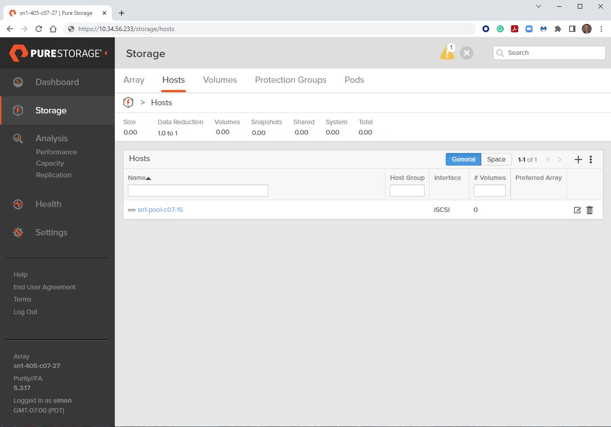
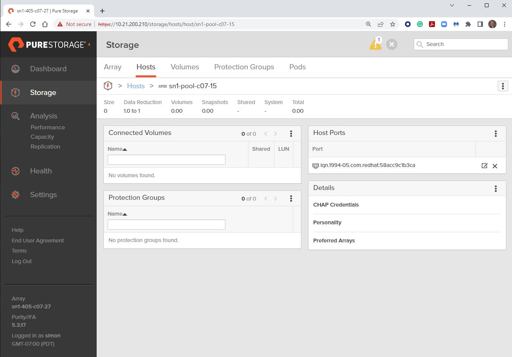

# Exercise 1.1 - Adding hosts to a FlashArray

## Table of Contents

- [Objective](#objective)
- [Guide](#guide)
- [Playbook Output](#playbook-outbook)
- [Solution](#solution)
- [Verifying the Solution](#verifying-the-solution)

# Objective

Demonstrate the use of the [purefa_host module](https://docs.ansible.com/ansible/latest/collections/purestorage/flasharray/purefa_host_module.html) to add a host to a Pure Storage FlashArray.

# Guide

## Step 1:

Using the text editor, create a new file called `purefa-host.yml`.

## Step 2:

Enter the following play definition into `purefa-host.yml`:

```yaml
---
- name: HOST SETUP
  hosts: localhost
  connection: local
  gather_facts: true
  vars:
    url: flasharray1.testdrive.local
    api: e448c603-ecfd-8b4e-fc02-0d742e81a779
```

- The `---` at the top of the file indicates that this is a YAML file.
- The `hosts: localhost`, indicates the play is run on the current host.
- `connection: local` tells the Playbook to run locally (rather than SSHing to itself)
- `gather_facts: true` enables facts gathering.
- The `vars:` parameter is a group of parameters to be used in the playbook.
- `url: flasharray1.testdrive.local` is the management IP address of your FlashArray - change this reflect your local environment.
- `api: e448c603-ecfd-8b4e-fc02-0d742e81a779` is the API token for a user on the FlashArra - change this reflect your local environment.

## Step 3:

Next, add the first `task` to the playbook. This task will use the `purefa_host` module to create a host object on the Pure Storage FlashArray.

```yaml
tasks:
  - name: CREATE HOST
    purestorage.flasharray.purefa_host:
      name: "{{ ansible_hostname }}"
      iqn: "{{ ansible_iscsi_iqn }}"
      fa_url: "{{ url }}"
      api_token: "{{ api }}"
```

- `name: CREATE HOST` is a user defined description that will display in the terminal output.
- `purefa_host:` tells the task which module to use.
- The `name` parameter tells the module to use the `ansible_hostname` variable obtained from the host fact gathering.
- The `iqn` parameter tells the module to use the `ansible_iscsi_iqn` variable obtained from the host fact gathering.
- The `fa_url: "{{url}}"` parameter tells the module to connect to the FlashArray Management IP address, which is stored as a variable `url` defined in the `vars` section of the playbook.
- The `api_token: "{{api}}"` parameter tells the module to connect to the FlashArray using this API token, which is stored as a variable `api` defined in the `vars` section of the playbook.

Save the file and exit out of the editor.

## Step 4:

Run the playbook - Execute the following:

```
[student1@ansible ~]$ ansible-playbook purefa-host.yml
```

# Playbook Output

The output will look as follows.

```yaml
[student1@ansible ~]$ ansible-playbook purefa-host.yml

PLAY [HOST SETUP] *******************************************************************************************************

TASK [Gathering Facts] **************************************************************************************************
ok: [localhost]

TASK [CREATE HOST] ******************************************************************************************************
changed: [localhost]

PLAY RECAP **************************************************************************************************************
localhost                  : ok=2    changed=1    unreachable=0    failed=0    skipped=0    rescued=0    ignored=0
```

# Solution

The finished Ansible Playbook is provided here: [purefa-host.yml](https://github.com/PureStorage-OpenConnect/ansible-workshop/blob/master/1.1-add-host/purefa-host.yml).

# Verifying the Solution

Login to the Pure Storage FlashArray with your web browser using the management IP address you set in your YAML file.

The list of hosts configured in the array can be found by navigating the menu on the left to Storage, then selecting the top menu item Hosts.

To obtain more detail on the host, including the iSCSI IQN initiator setting, select the host name in the Hosts sub-window.
