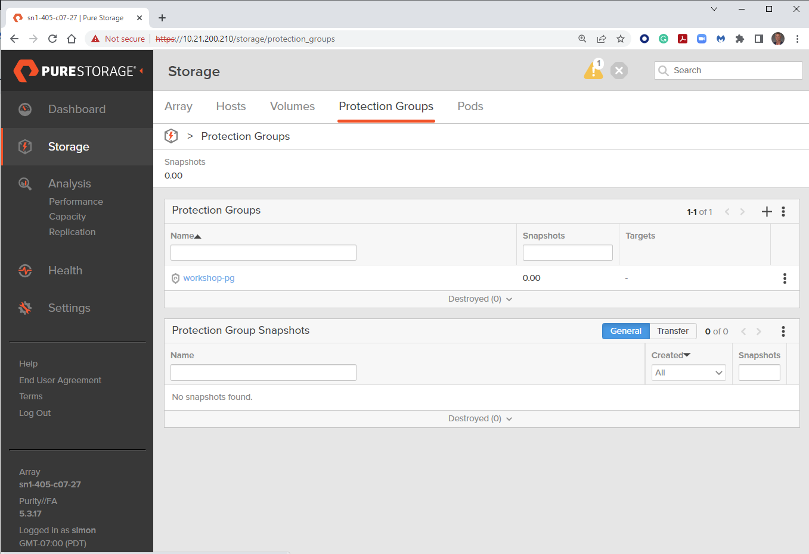
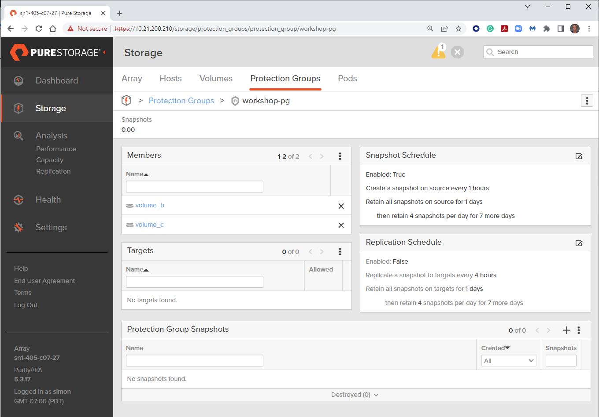

# Exercise 1.4 - Creating a Protection Group on a FlashArray

# Objective

Demonstrate the use of the [purefa_pg module](https://docs.ansible.com/ansible/latest/collections/purestorage/flasharray/purefa_pg_module.html) to create a protection group on a Pure Storage FlashArray and assign existing volumes to it.

# Guide

## Step 1:

Using the text editor, create a new file called `purefa-pgroup.yml`.

## Step 2:

Enter the following play definition into `purefa-group.yml`:

```yaml
---
- name: PROTECTION GROUP SETUP
  hosts: localhost
  connection: local
  gather_facts: true
  vars:
    url: flasharray1.testdrive.local
    api: e448c603-ecfd-8b4e-fc02-0d742e81a779
```

- The `---` at the top of the file indicates that this is a YAML file.
- The `hosts: localhost`, indicates the play is run on the current host.
- `connection: local` tells the Playbook to run locally (rather than SSHing to itself)
- `gather_facts: true` enables facts gathering.
- The `vars:` parameter is a group of parameters to be used in the playbook.
- `url: flasharray1.testdrive.local` is the management IP address of your FlashArray - change this reflect your local environment.
- `api: e448c603-ecfd-8b4e-fc02-0d742e81a779` is the API token for a user on the FlashArra - change this reflect your local environment.

## Step 3:

Next, add the first `task` to the playbook. This task will use the `purefa_pg` module to create a protection group on the Pure Storage FlashArray and assign two pre-existing volumes to the protection group.

```yaml
tasks:
  - name: CREATE PROTECTION GROUP
    purestorage.flasharray.purefa_pg:
      name: workshop-pg
      volume:
        - volume_b
        - volume_c
      fa_url: "{{ url }}"
      api_token: "{{ api }}"
```

- `name: CREATE PROTECTION GROUP` is a user defined description that will display in the terminal output.
- `purefa_host:` tells the task which module to use.
- The `name` parameter tells the module the name of the protection group to create.
- The `volume` parameter provides the module with a list of exisitng volumes to put in the protection group.
- The `fa_url: "{{url}}"` parameter tells the module to connect to the FlashArray Management IP address, which is stored as a variable `url` defined in the `vars` section of the playbook.
- The `api_token: "{{api}}"` parameter tells the module to connect to the FlashArray using this API token, which is stored as a variable `api` defined in the `vars` section of the playbook.

Save the file and exit out of the editor.

## Step 4:

Run the playbook - Execute the following:

```
$ ansible-playbook purefa-pgroup.yml
```

# Playbook Output

```yaml
$ ansible-playbook purefa-pgroup.yml

PLAY [PROTECTION GROUP SETUP] *******************************************************************************************

TASK [Gathering Facts] **************************************************************************************************
ok: [localhost]

TASK [CREATE PROTECTION GROUP] ******************************************************************************************
changed: [localhost]

PLAY RECAP **************************************************************************************************************
localhost                  : ok=2    changed=1    unreachable=0    failed=0    skipped=0    rescued=0    ignored=0
```

# Verifying the Solution

Login to the Pure Storage FlashArray with your web browser.

The list of protection groups configured in the array can be found by navigating the menu on the left to Storage, then selecting the top menu item Protection Groups.

Selecting the created protection group will give more detail on the contents of the group,
